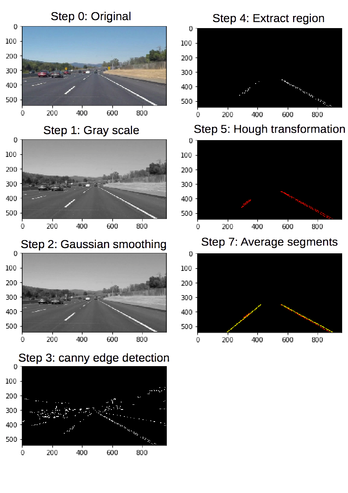

# **Finding Lane Lines on the Road**

This is my first project report.

### Reflection

### 1. Describe your pipeline. As part of the description, explain how you modified the draw_lines() function.

My pipeline consist of the following steps:

1. Convert image to grayscale.
2. Applies Gaussian smoothing.
3. Applies Canny edge detection.
4. Extract a trapezoidal region whose size is calculated relative to the given image size.
5. Applies Hough transformation.
6. Split line segments calculated by step 5 into right and left segment set.
7. Average each segment sets by using linear regression.
8. Calculate time average of the result of step 7 over the fixed time window.

An example of each step is shown.

In order to get a single line, I averaged the line segments calculated by Hough transformation. Each line segment is classified into left or right lanes based on the `x` (horizontal) position of the center of the segment (ex.`(x1 + x2)/2`). Averaging of line segments is achieved by using linear regression of segment end points (i.e. line1:$((x_{11}, y_{11}), (x_{12}, y_{12}))$, line2:$((x_{21}, y_{21}), (x_{22}, y_{22}))$, ...). Furthermore, in the linear regression, I modified the weight of points according to the segment length to make long segment have a larger contribution.

Lanes are not continuous and they have some breaks. In the movie, these breaks make small vibration of averaged lines. To stabilize such a small vibration, I apply time average of averaged lines which are calculated in step 7. In the time average, the newest line is the most important line and older lines are less important. To incorporate this effect, I introduce the decay rate in the time average. The $x$ position of $n$-th line is given by
$$
  \bar{x}_n = \sum_{i=0}^T r^{i} x_{n-i},
$$
where $T$ is a time window of average and $r (\le 1)$ is decay rate.

### 2. Identify potential shortcomings with your current pipeline

Since my model assumes that the two lanes are arranged symmetrically, when the car changes a lane or take a curve, the model will misidentify the lanes positions.

The second shortcoming is that the model detects lane position based on the difference of brightness between lane and background road. The model parameters are adjusted to the limited examples. However, the differences in brightness between lane and road will change depending on many factors such as weather or time of the day.

Another shortcoming is that the model assumes that the lanes are straight lines. Therefore the model can not draw any curved line.

### 3. Suggest possible improvements to your pipeline

In this model, we simply assume that vertical line in a certain area is a part of lanes. This seems too simple condition and will make a misidentification. Additional conditions such as a lane should be a rectangular bright region can improve accuracy.

In the model, the model parameters are constant throughout a driving. Optimal parameters will change between sunny and rainy day. If we can dynamically adjust the model parameters based on the given image, the model performance can be improved.

At the linear regression step (step 7), I assume that a target function is a linear function (1st order polynomial). In order to draw curved lane, we can use multi order polynomial function as a target function.
